# Модуль создание дайджестов

Все работает в asyncio

## Алгоритм

```mermaid
stateDiagram-v2
    consume_queue: Ожидание события от "parser" с информацией по посту
    [*] --> consume_queue
    lock: Синхронный блок
    state lock {
        has_next_gtp_acc: Есть ли еще неиспользованный аккаунт ChatGTP?
        reset_index_gtp_acc: Сбросить индексы
        update_gtp_accounts: Получить активные аккаунты ChatGTP
        next_index_gtp_acc: Инкриминировать индекс

        state has_next_gtp_acc_state <<choice>>
        [*] --> has_next_gtp_acc
        has_next_gtp_acc --> has_next_gtp_acc_state
        has_next_gtp_acc_state --> reset_index_gtp_acc: Нет
        reset_index_gtp_acc --> update_gtp_accounts
        update_gtp_accounts --> next_index_gtp_acc
        has_next_gtp_acc_state --> next_index_gtp_acc: Да
        next_index_gtp_acc --> [*]
    }
    find_all_subs_with_tone: Найти все подписки по канал полученного поста 
    for_each_sub: По каждой подписке
    state for_each_sub {
        state is_tone_processed_state <<choice>>
        is_tone_processed: Тон подписки был обработан?
        continue_for_each_sub: Продолжить
        while_true: Пока не
        state while_true {
            get_active_gtp_accounts: Получить все активные аккаунты ChatGTP
            if_there_no_active_gtp_accounts: Есть ли активные аккаунты ChatGTP
            state if_there_no_active_gtp_accounts_state <<choice>>
            return_text: Вернуть исходный текст
            for_each_gtp_acc_from_index: По каждому аккаунту ChatGTP
            state for_each_gtp_acc_from_index {
                request_to_gtp_acc: Запрос на обработку поста \n в определенном тоне в ChatGTP
                is_result_valid: Результат валиден?
                state is_result_valid_state <<choice>>
                return_summary: Вернуть обработанный пост
                continue_for_each_gtp_acc_from_index: Продолжить

                [*] --> request_to_gtp_acc
                request_to_gtp_acc --> is_result_valid
                is_result_valid --> is_result_valid_state
                is_result_valid_state --> return_summary: Да
                is_result_valid_state --> continue_for_each_gtp_acc_from_index: Нет
                return_summary --> [*]
            }

            [*] --> get_active_gtp_accounts
            get_active_gtp_accounts --> if_there_no_active_gtp_accounts
            if_there_no_active_gtp_accounts --> if_there_no_active_gtp_accounts_state
            if_there_no_active_gtp_accounts_state --> return_text: Нет
            if_there_no_active_gtp_accounts_state --> for_each_gtp_acc_from_index: Да
            return_text --> [*]
            for_each_gtp_acc_from_index --> [*]
        }
        
        [*] --> is_tone_processed
        is_tone_processed --> is_tone_processed_state
        is_tone_processed_state --> while_true: Нет
        is_tone_processed_state --> continue_for_each_sub: Да
        while_true --> [*]
    }
    for_each_sum: По каждому версии обработанного поста по тону
    state for_each_sum {
        save_sum: Сохранить обработанный пост по тону

        [*] --> save_sum
        save_sum --> [*]
    }
    for_each_saved_sum: Для каждого обработанного поста по тону
    state for_each_saved_sum {
        bind_sum_to_user_digest: Привязать обработанный пост к дайджесту

        [*] --> bind_sum_to_user_digest
        bind_sum_to_user_digest --> [*]
    }

    consume_queue --> lock
    lock --> find_all_subs_with_tone
    find_all_subs_with_tone --> for_each_sub
    for_each_sub --> for_each_sum
    for_each_sum --> for_each_saved_sum
    for_each_saved_sum --> [*]
```

## Описание

Вся работа модуля сводится обработке поста через ChatGTP и его последующее сохранение

## Проблемы

- Сам модуль не выполняет тяжёлую работу чтобы выводить его работу в отдельный процесс
  Все сводится к http запросам в ChatGTP и запросам к БД, что при правильном проектировании
  можно оптимизировать через стандартный механизм async
- Берем всегда **ВСЕ** из БД
- Прохождение по аккаунтам ChatGTP происходит в sync блоке, хотя можно обойтись и без него
  (Не в плане убрать а по другому запрограммировать)